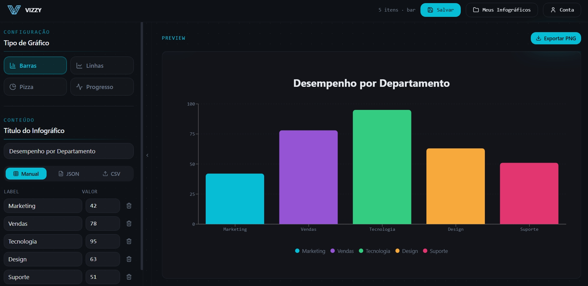
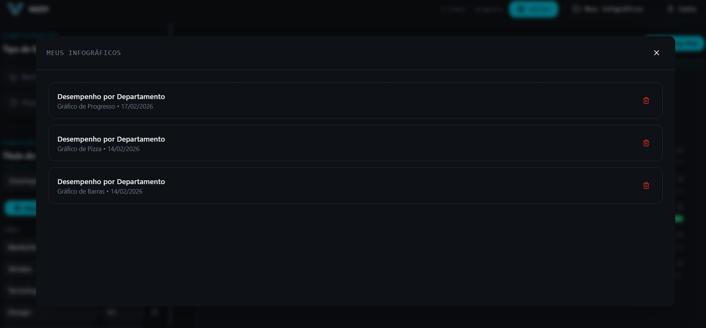
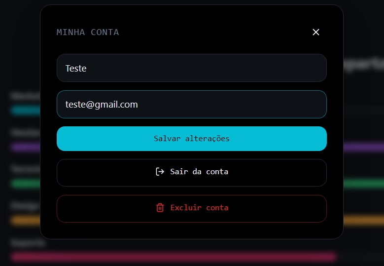
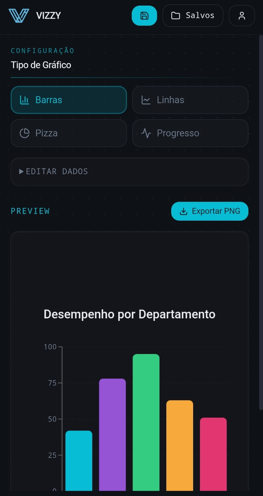
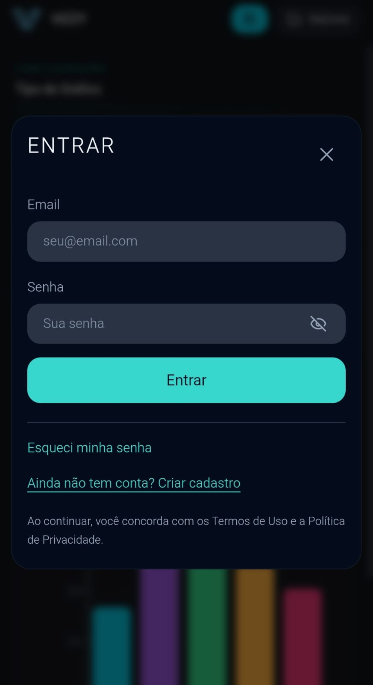
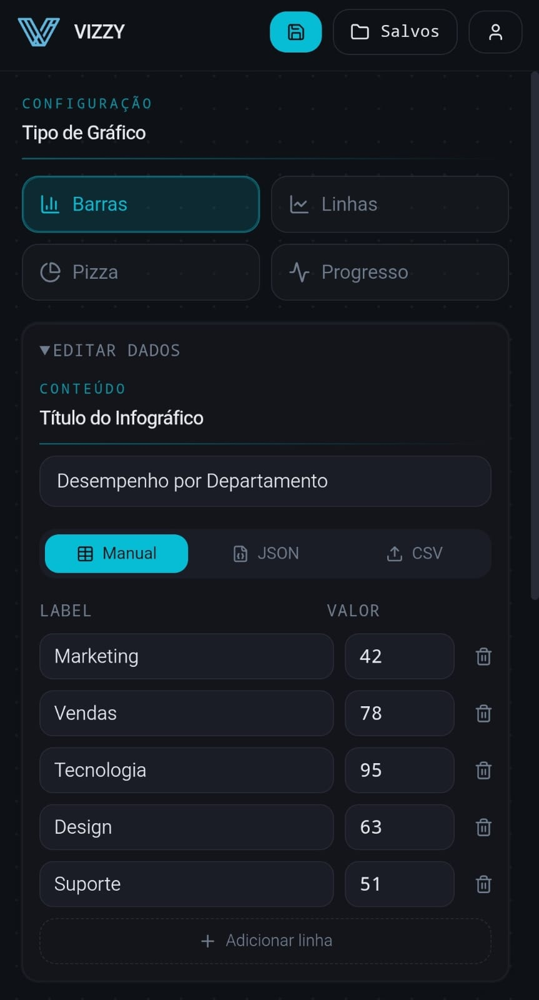

# Vizzy

Aplicação web para criação de infográficos interativos, com edição em tempo real, foco em experiência visual e fluxo de uso simples.

## 🚀 Funcionalidades

- Criação e edição de gráficos em tempo real
- Tipos de gráfico: barras, linha, pizza e progresso
- Entrada de dados por formulário, JSON e CSV
- Salvamento local de infográficos
- Exportação de gráfico (com controle de acesso)
- Área de conta com edição de perfil, logout e exclusão de conta
- Fluxo de autenticação com login, cadastro e redefinição de senha local

## 🧩 Tecnologias

- React 18
- TypeScript
- Vite
- Tailwind CSS
- Recharts
- Framer Motion
- Sonner (toasts)
- Vitest + Testing Library

## 🎨 Design e Experiência

- Interface dark com foco em legibilidade
- Modal de autenticação responsivo (mobile e desktop)
- Animações suaves de transição entre login, cadastro e redefinição
- Feedback visual de validação de campos e estados de erro

## 📸 Screenshots

### Desktop

<br />

<br />


### Mobile




## 🔐 Autenticação e Controle de Acesso

- Autenticação local via `localStorage`
- Senhas armazenadas com hash (com compatibilidade para dados legados)
- Regras atuais:
  - `Salvar`: livre (sem login)
  - `Meus Infográficos`: exige login
  - `Exportar PNG`: exige login

## 🧠 Aprendizado

Este projeto consolidou prática em:

- Componentização com React + TypeScript
- Modelagem de estado e fluxos de UI
- Responsividade com Tailwind CSS
- Animações com Framer Motion
- Controle de acesso no front-end

## 📋 Pré-requisitos (para rodar o projeto)

- Node.js 18+ (recomendado)
- npm 9+ (ou compatível)

## 🔧 Instalação

```bash
npm install
npm run dev
```

Aplicação disponível em:

`http://localhost:8080`

## 📁 Estrutura do Projeto

- `src/pages/Index.tsx`: tela principal e fluxo central do app
- `src/components/infographic/*`: entrada de dados, seleção de gráfico e preview
- `src/components/auth/*`: login, cadastro, redefinição e conta
- `src/components/ui/*`: componentes utilitários de interface
- `src/types/infographic.ts`: tipagens de domínio do infográfico

## 📝 Scripts Disponíveis

- `npm run dev`: inicia ambiente de desenvolvimento
- `npm run build`: gera build de produção
- `npm run build:dev`: gera build no modo development
- `npm run preview`: serve o build localmente
- `npm run lint`: executa lint
- `npm run test`: executa testes uma vez
- `npm run test:watch`: executa testes em modo watch

## 📄 Licença

Este projeto está sob a licença MIT.  
Veja o arquivo `LICENSE`.

## 👩‍💻 Autora

Desenvolvido por Flávia Souza – Desenvolvedora Front-end Web e Mobile

⭐ Se este projeto te ajudou ou te inspirou, considere dar uma estrela no GitHub!
